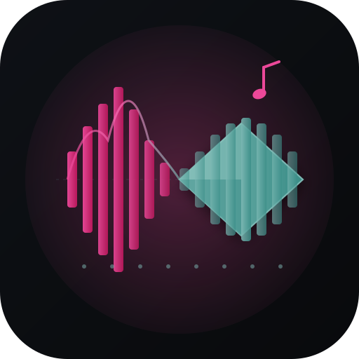

# MelosViz

<p align="center">
  <a href="assets/brand/icon.svg"></a>
</p>
<p align="center"><em>Music visualization studio — analyze audio, render 3D scenes, perform live with your tracks.</em></p>
<p align="center"><sub>MelosViz (warm spectrum) palette · <a href="docs/assets/identity/">visual identity demo</a></sub></p>

[](https://sladge.net) [](https://github.com/KooshaPari/Melosviz/releases)

---

> Music visualization studio — analyze audio, render 3D scenes, perform live with your tracks.

## Features
- **BPM + key detection**: librosa-powered with beat-time sync
- **3D R3F renderer**: React Three Fiber with BeatPulse torus animation
- **WaveSurfer.js**: waveform display with playback cursor sync
- **Preset editor**: Radix Dialog + Sliders (energy, tempo, saturation, brightness)
- **Playlist/queue**: @dnd-kit drag-to-reorder, multi-file, auto-advance
- **Keyboard shortcuts**: Space, ←/→, ?, p, f
- **Mobile responsive**: collapsible playlist bottom drawer
- **Loading skeletons**: shimmer animation for scene/waveform/analysis
- **PWA**: installable with theme-color and manifest

## Quick Start

Install [Task](https://taskfile.dev) once (`brew install go-task`) — it's the only required runner.

### Offline playground (no GPU, no ComfyUI)
```
task install       # uv venv + melosviz into .venv, melosviz-demo Rust binary into target/
task demo          # Rust binary drives storyboard → generate → ship end-to-end
ls /tmp/melosviz-demo/generate/final.zip   # 10-file deterministic bundle
```

### Production studio (with GPU + ComfyUI + Bridge + Web)
```
task dev-up        # docker compose stack (ComfyUI + C4D stub + bridge)
task dev-pipeline  # render a track end-to-end through the real pipeline
```

### Web studio
```
cd backend && pip install -r requirements.txt
uvicorn src.melosviz.bridge.server:app --port 5000

cd web && bun install && bun run dev
```

### Native app (macOS .app / Windows .exe)
```
task app           # one-shot: cargo build + electrobun bundle
open dist/MelosViz.app   # macOS
dist\MelosViz.exe        # Windows
```

## Deploy to Vercel
```
cd web && npx vercel deploy --prod
```
See [VERCEL_DEPLOY.md](docs/guides/quick-start/VERCEL_DEPLOY.md) for full guide.