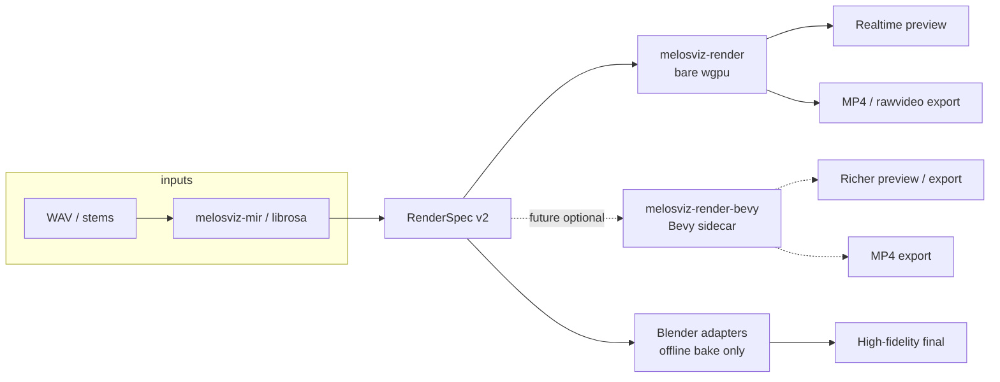

# Render Engine Decision — MelosViz Local Studio

**Status:** Accepted  
**Date:** 2026-07-13  
**Branch:** `feat/melosviz-bevy-spike`  
**Related:** [`PERF_BENCHMARK.md`](PERF_BENCHMARK.md), [`ARCHITECTURE.md`](ARCHITECTURE.md), `crates/melosviz-render-wgpu/`

---

## Context

Operators evaluating MelosViz local studio often ask whether the product needs **Vulkan, DirectX 12, or Metal** explicitly, and whether to adopt **Bevy** or **Unreal Engine** as the GPU stack.

MelosViz is a **spec-first** desktop product: Electrobun shell, Python bridge sidecar, and Rust render binaries spawned the same way as today’s `melosviz-render`. The canonical input is **RenderSpec v2**; render backends are interchangeable adapters, not the source of truth.

---

## Decision

| Horizon | Choice | Rationale |
|---------|--------|-----------|
| **Near-term (ship)** | **Bare wgpu** — `crates/melosviz-render-wgpu` (`melosviz-render` binary) | Already in-repo; smallest binary; meets preview + MP4 export targets per [`PERF_BENCHMARK.md`](PERF_BENCHMARK.md). |
| **Mid-term (optional)** | **Bevy sidecar** consuming the same RenderSpec v2 | Heavier ECS/scene graph when visual complexity outgrows hand-rolled WGSL; same Electrobun spawn pattern as `melosviz-render`. |
| **Out of scope** | **Unreal Engine** | Wrong default: huge runtime, licensing/packaging burden, and sidecar integration cost. Defer to F3/org-only exploration if ever. |

### GPU APIs (Vulkan / DX12 / Metal)

**No separate engine choice is required to get native GPU APIs.**

`melosviz-render-wgpu` uses [wgpu](https://wgpu.rs/), which selects backends at runtime:

| Platform | wgpu backend |
|----------|----------------|
| Windows | **DX12** (primary), Vulkan fallback where configured |
| Linux | **Vulkan** |
| macOS / iOS | **Metal** |

The crate comment in `crates/melosviz-render-wgpu/Cargo.toml` documents this mapping. Unreal does **not** add Metal/Vulkan/DX12 coverage that wgpu lacks — it adds a full game engine we do not need for beat-synced music-video export.

### Bevy vs bare wgpu

| | Bare wgpu (`melosviz-render-wgpu`) | Bevy sidecar (future) |
|---|-----------------------------------|------------------------|
| Stack | WGSL shaders, minimal Rust | ECS + scene graph on top of wgpu |
| Cold start | ~5 ms class (est.) | ~150 ms class (est.) |
| Fit | Current MelosViz layers (beat pulse, spectral hue, stems, segments) | Richer scenes, animation curves, many entities |
| Integration | **Now** — primary path | **Optional** — parallel binary, same RenderSpec contract |

[`PERF_BENCHMARK.md`](PERF_BENCHMARK.md) §3–4 already recommends bare wgpu for preview + export and Bevy only if scene-graph complexity grows.

### Why not Unreal

- **Runtime size:** orders of magnitude larger than a wgpu/Bevy sidecar; conflicts with lean Electrobun packaging.
- **Licensing & distribution:** Epic terms, content tooling, and platform compliance are out of band for a local MIR→video studio.
- **Sidecar model:** spawning UE as a headless render worker alongside the Python bridge is fragile (editor/runtime paths, project assets, no RenderSpec-native pipeline).
- **Product fit:** MelosViz needs deterministic, spec-driven 2.5D visuals — not a AAA scene editor.

Revisit only under explicit **F3 / org** mandate (e.g. broadcast partner already standardized on UE).

---

## Architecture flow

**Near-term path (solid):** RenderSpec v2 → `melosviz-render` (wgpu, DX12/Vulkan/Metal) → preview window or ffmpeg pipe → MP4.

**Future branch (dashed):** same RenderSpec → optional Bevy binary, spawned like today’s Rust render sidecar — no schema fork.

**Blender** remains the offline high-fidelity bake path (Cycles / EEVEE); not replaced by this decision.

---

## Consequences

1. **Engineering focus:** finish and harden `melosviz-render-wgpu` (primary backends, export, segment cache) — not evaluate UE or rewrite on Bevy first.
2. **Desktop spawn:** keep existing Electrobun → sidecar pattern; a future Bevy crate is another fixed-path binary, not an in-process plugin.
3. **Dependencies:** no Bevy or Unreal crates in the default workspace until a Bevy spike proves scene-graph need.
4. **Documentation:** performance claims stay in [`PERF_BENCHMARK.md`](PERF_BENCHMARK.md); this doc is the product/engine **policy**.

---

## Alternatives considered

| Alternative | Rejected because |
|-------------|------------------|
| Unreal as default GPU engine | Cost, size, licensing, poor fit for spec-first sidecar |
| Bevy now, skip bare wgpu | Bare path already exists and is faster to ship; Bevy is additive |
| Vulkan/DX12/Metal via UE only | wgpu already exposes all three (via Metal on Apple) |
| Blender EEVEE for realtime preview | Measured ~19 fps vs wgpu est. 200+ fps; keep for bake/scrub only |
