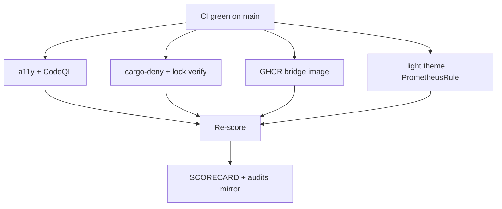

# MelosViz Work DAG

Atomic, FR-linked tasks agents can claim independently.

## Ready / in-flight (this wave)

| ID | Task | FR / pillar | Effort | Status |
|----|------|-------------|--------|--------|
| W-204 | axe CI for web fixture | C09 | M | THIS PR |
| W-205 | Playwright screenshot golden | C10 L107 | M | THIS PR |
| W-206 | Light theme tokens | C10 L104 | M | THIS PR |
| W-207 | CodeQL workflow in-repo | C04 L36 | M | THIS PR |
| W-208 | cargo-deny license lane | C06 L56 | M | THIS PR |
| W-209 | Frozen lock verify | C06 L58 | S | THIS PR |
| W-218 | atheris fuzz harness seed | C07 L67 | M | THIS PR |
| W-219 | GHCR production bridge image | C11 L118 | M | THIS PR |
| W-220 | PrometheusRule manifests | C05 L48 | M | THIS PR |
| W-221 | USER_JOURNEYS + ENV + UNINSTALL | C03/C11 | S | THIS PR |
| W-222 | Re-score + SCORECARD | audit | S | THIS PR |

## Completed

| ID | Task | Status |
|----|------|--------|
| W-101…W-110 | Windows/OTLP/DX wave | merged (#127) |
| W-201…W-217 | Eval + auto-update wave | merged (#128) |

## Backlog (remaining hard items)

| ID | Task | Effort |
|----|------|--------|
| W-223 | Native mobile (iOS/Android) | L |
| W-224 | Apple notarization / Authenticode | L |
| W-225 | Offline air-gap install bundle | L |
| W-226 | Live Harbor runner in CI | M |
| W-227 | Rust↔Python parity harness | M |
| W-228 | Org signed-commit enforcement | org |

## Claim protocol

1. `claim W-2xx` on PR/issue.
2. Branch `feat/w2xx-<slug>`.
3. Reference FR ID in PR body.
