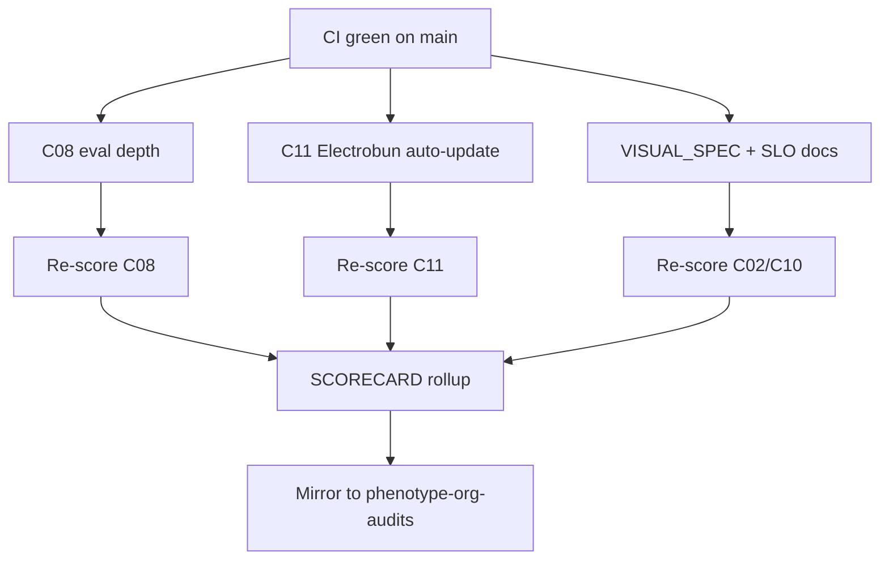

# MelosViz Work DAG

Atomic, FR-linked tasks agents can claim independently. Prefer one PR per
node unless a cluster is explicitly marked as a batch.

## Ready / in-flight (this wave)

| ID | Task | FR / pillar | Effort | Status |
|----|------|-------------|--------|--------|
| W-201 | Electrobun auto-update wiring | C11 L111 | M | THIS PR |
| W-202 | Harbor/portage eval adapter | C08 L76 | M | THIS PR |
| W-203 | Golden WAV corpus + parity harness | C08 L71/L77 | M | THIS PR |
| W-211 | Bridge load smoke + CI | C08 L73 | M | THIS PR |
| W-212 | EVAL.md index + flaky marker | C08 L78/L80 | S | THIS PR |
| W-213 | VISUAL_SPEC.md | C10 L107 | S | THIS PR |
| W-214 | SLO / error-budget doc | C02 L27 | S | THIS PR |
| W-215 | Profiling runbook notes | C05 L45 | S | THIS PR |
| W-216 | RenderSpec JSON fuzz (hypothesis) | C07 L67 seed | S | THIS PR |
| W-217 | Re-score + SCORECARD | audit | S | THIS PR |

## Completed (prior wave)

| ID | Task | Status |
|----|------|--------|
| W-101…W-110 | Windows release, OTLP, DX/gov, cov gate, mutmut | merged (#127) |

## Backlog (claim next)

| ID | Task | FR / pillar | Effort |
|----|------|-------------|--------|
| W-204 | axe/pa11y CI for web | C09 | M |
| W-205 | Screenshot goldens (Playwright) | C10 | M |
| W-206 | Light theme tokens | C10 L104 | M |
| W-207 | CodeQL workflow in-repo | C04 L36 | M |
| W-208 | cargo-deny license lane | C06 L56 | M |
| W-209 | Frozen lock verify (`uv sync --frozen`) | C06 L58 | S |
| W-218 | cargo-fuzz / atheris targets | C07 L67 | L |
| W-219 | GHCR production bridge image | C11 L118 | M |
| W-220 | PrometheusRule manifests | C05 L48 | M |

## Claim protocol

1. Comment on the PR or issue: `claim W-2xx`.
2. Branch: `feat/w2xx-<slug>`.
3. Reference the FR ID in the PR body.
4. Update this table Status column when merging.
