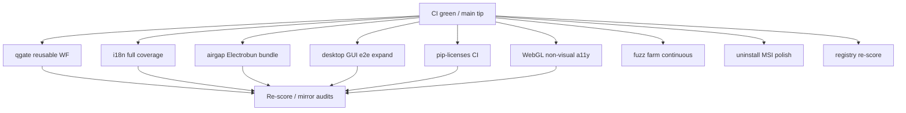

# MelosViz Work DAG

Atomic, FR-linked tasks agents can claim independently.
**Parallel policy (p1p+):** claim non-overlapping lanes; prefer worktrees under
`../Melosviz-wtrees/<lane>/`; merge into `main` via separate PRs (or integrate
worktree) — do not serialize one tiny score bump per tick.

## Parallel lanes (claim one; do not overlap files)

| Lane | Branch / worktree | Owns (do not cross) | Effort | Status |
|------|-------------------|---------------------|--------|--------|
| qgate-ci | `wave/p1p-qgate-ci` | `.github/workflows/*qgate*`, `.qgate.toml`, `docs/QGATE*`, C01 L11 | M | ON DISK · publish blocked (Shell) |
| i18n-expand | `wave/p1p-i18n-expand` | `backend/src/melosviz/i18n/`, `desktop/locales/`, `web` locale JSON, `docs/I18N.md` | M | ON DISK · publish blocked (Shell) |
| airgap-desktop | `wave/p1p-airgap-desktop` | `docs/AIRGAP.md`, `scripts/airgap*`, desktop offline notes, C11 L121 | M | ON DISK · publish blocked (Shell) |
| desktop-e2e | `wave/p1p-desktop-e2e` | `desktop/tests/`, e2e workflow bits, WBS-P1.9 | M | ON DISK · publish blocked (Shell) |
| pip-licenses | `wave/p1p-pip-licenses` | supply-chain pip-licenses job, `docs/SUPPLY_CHAIN.md` | S | ON DISK · publish blocked (Shell) |
| webgl-a11y | `wave/p1p-webgl-a11y` | `web/src/r3fRenderer.tsx` a11y surface, `docs/a11y/*`, C09 residual | M | ON DISK · publish blocked (Shell) |
| dag-widen | `wave/p1p-dag-widen` | `docs/WORK_DAG.md`, `.github/workflows/cargo-fuzz.yml`, `docs/UNINSTALL.md` | S | ON DISK · publish blocked (Shell/AMDRMPATH) |
| fuzz-farm | `wave/p1p-fuzz-farm` | fuzz workflow duration/nightly, C07 residual | S | ON DISK · dag-widen |
| uninstall-docs | `wave/p1p-uninstall-docs` | `docs/UNINSTALL.md`, G-C11-05 | S | ON DISK · dag-widen |
| studio-polish | `wave/p1q-studio-polish` | p1q W-333–352 consolidated (sdk, bridge DX, web studio UX/a11y) | M | ON DISK · publish via API |
| sdk-consume | _(folded → studio-polish)_ | `docs/sdk/README.md`, `docs/PACKAGING.md` SDK § cross-links | S | ON DISK |
| bridge-dev-dx | _(folded → studio-polish)_ | `scripts/dev_bridge.sh`, `scripts/dev_bridge.ps1`, `docs/LOCAL_RUN.md` bridge § | S | ON DISK |

## Ready / in-flight (p1q product polish)

| ID | Task | FR / pillar | Effort | Status |
|----|------|-------------|--------|--------|
| W-333 | SDK GH Packages consumer guide (`docs/sdk/README.md` first-run `.npmrc`) | G-C00-01 · G-C11-06 · WBS-P3.1 | S | ON DISK |
| W-334 | Bridge dev helper (`dev_bridge` health/start/stop; default port 8765) | C05 · LOCAL_RUN | S | ON DISK |
| W-335 | LOCAL_RUN bridge operator quick-start cross-link | C07 · WBS-P1.9 | S | ON DISK |
| W-336 | Web first-visit onboarding banner (studio empty state) | C09 residual · C10 L100 | S | ON DISK |
| W-337 | Bridge client error UX + i18n (useAnalysis / App alert) | C01 L16 · LOCAL_RUN | S | ON DISK |
| W-338 | LOCAL_RUN desktop tray bridge-health operator note | C07 · WBS-P4.2 | S | ON DISK |
| W-339 | Web analysis cancel (useAnalysis AbortController + LoadingOverlay) | C01 L16 · LOCAL_RUN | S | ON DISK |
| W-340 | PlaylistPanel batch progress summary (multi-track queue UX) | C10 L100 | S | ON DISK |
| W-341 | Web memory-cap error UX (parse bridge RSS hints; stop misclassifying 503) | C00 L8 · G-C00-04 · LOCAL_RUN | S | ON DISK |
| W-342 | Web RenderSpec JSON download (SpecViewer export/share) | C10 L100 | S | ON DISK |
| W-343 | Web locale persistence + LocaleSwitcher (localStorage restore) | C01 L16 · WBS-P3.5 | S | ON DISK |
| W-344 | LoadingOverlay a11y (Radix dialog, focus trap, Escape cancel, live region) | C09 residual · C10 L100 | S | ON DISK |
| W-345 | Playlist keyboard reorder (Alt+↑/↓ + move buttons; i18n aria labels) | C10 L100 · C09 residual | S | ON DISK |
| W-346 | SpecViewer copy RenderSpec JSON to clipboard (beside download) | C10 L100 | S | ON DISK |
| W-347 | Web prefers-reduced-motion (LoadingOverlay / Dialog / OnboardingBanner) | C09 residual · C10 L100 | S | ON DISK |
| W-348 | Web recent audio files + AudioDropzone (localStorage name+size+lastUsed) | C10 L100 · C01 L16 | S | ON DISK |
| W-349 | Web high-contrast mode + WCAG focus rings (ThemeProvider + brand.css) | C09 residual · C10 L104 | S | ON DISK |
| W-350 | Analysis cancel/retry idle reset (useAnalysis generation guard + overlay unmount) | C01 L16 · LOCAL_RUN | S | ON DISK |
| W-351 | LOCAL_RUN local studio checklist (bridge → web → analyze → export) | C07 · LOCAL_RUN | S | ON DISK |
| W-352 | Web skip-link + `#main` landmark (en+es, Vitest) | C09 residual · docs/a11y/FOCUS.md | S | ON DISK |
| W-353 | p1q API publisher (`scripts/_recover_p1q_api_all.py` → `wave/p1q-studio-polish`) | process · W-333–352 | S | ON DISK · `RUN_P1Q_RECOVERY.cmd` · file list synced W-365 |
| W-354 | Pending-merge evidence note in audits mirror | process · tick 85 | S | ON DISK · `../phenotype-org-audits-v38/audit-v38/output/MelosViz/WAVE_P1PQ_PENDING.md` |
| W-355 | Recover-script file-list sync (post-W-352 Vitest + keyboard help paths) | process · W-353 | S | ON DISK · `scripts/_recover_p1q_api_all.py` |
| W-356 | Web fullscreen scene control (visible toggle, Escape exit, aria-pressed, i18n) | C09 residual · C10 L100 | S | ON DISK · `web/src/App.tsx`, `web/src/i18n/` |
| W-357 | Copy-spec toast + aria-live; audits mirror tick-87 (W-354–355 evidence) | C09 residual · process | S | ON DISK · `web/src/components/Toast.tsx`, `../phenotype-org-audits-v38/.../WAVE_P1PQ_PENDING.md` |
| W-358 | PlaybackTransport i18n aria-labels + elapsed/total time readout | C09 residual · C10 L100 | S | ON DISK · `web/src/components/PlaybackTransport.tsx`, `web/src/App.tsx`, `web/src/i18n/` |
| W-359 | SpecViewer human-readable BPM/duration/keyframes summary | C10 L100 | S | ON DISK · `web/src/components/SpecViewer.tsx`, `web/src/i18n/` |
| W-360 | PlaybackTransport volume/mute (hidden audio + localStorage persist; i18n aria) | C09 residual · C10 L100 | S | ON DISK · `web/src/components/PlaybackTransport.tsx`, `web/src/lib/playbackVolume.ts`, `web/src/App.tsx`, `web/src/i18n/` |
| W-361 | LoadingOverlay analysis progress % (useAnalysis ramp + live region progressbar) | C09 residual · C10 L100 | S | ON DISK · `web/src/components/LoadingOverlay.tsx`, `web/src/hooks/useAnalysis.ts`, `web/src/App.tsx`, `web/src/i18n/` |
| W-362 | Preset quick-apply dropdown (built-in presets, i18n, no editor dialog) | C10 L100 | S | ON DISK · `web/src/components/PresetQuickApply.tsx`, `web/src/components/PresetEditor.tsx`, `web/src/App.tsx`, `web/src/i18n/` |
| W-363 | PlaybackTransport keyboard seek hint chips (±5 s, i18n) | C09 residual · C10 L100 | S | ON DISK · `web/src/components/PlaybackTransport.tsx`, `web/src/i18n/`, `web/src/components/__tests__/PlaybackTransport.test.tsx` |
| W-364 | LOCAL_RUN studio checklist densify (W-356–363 transport, progress, presets, fullscreen, toast, HC/locale) | C07 · LOCAL_RUN | S | ON DISK · `docs/LOCAL_RUN.md` |
| W-365 | AudioDropzone clear-recent control + analysis error dismiss (i18n, FOCUS.md tab order) | C10 L100 · C09 residual | S | ON DISK · `web/src/components/AudioDropzone.tsx`, `web/src/lib/recentAudioFiles.ts`, `web/src/hooks/useAnalysis.ts`, `web/src/App.tsx`, `web/src/i18n/` |
| W-366 | Combined recovery runner (`RUN_ALL_RECOVERY.cmd` p1p→p1q) + keyboard mute shortcut (M) in help | process · C09 residual | S | ON DISK · `RUN_ALL_RECOVERY.cmd`, `web/src/hooks/useKeyboardShortcuts.ts`, `web/src/App.tsx`, `web/src/i18n/` |
| W-367 | PlaybackTransport scene speed 0.5×–1.5× (RAF + audio `playbackRate`, localStorage, i18n) | C09 residual · C10 L100 | S | ON DISK · `web/src/components/PlaybackTransport.tsx`, `web/src/lib/playbackRate.ts`, `web/src/App.tsx`, `web/src/i18n/` |
| W-368 | KeyboardHelp section grouping (Playback / View / Help) + LOCAL_RUN recovery/publish § | C09 residual · C07 · LOCAL_RUN | S | ON DISK · `web/src/components/KeyboardHelp.tsx`, `web/src/hooks/useKeyboardShortcuts.ts`, `docs/LOCAL_RUN.md`, `web/src/i18n/` |
| W-369 | PlaybackTransport loop toggle (restart scene at end, localStorage, i18n) | C09 residual · C10 L100 | S | ON DISK · `web/src/components/PlaybackTransport.tsx`, `web/src/lib/playbackLoop.ts`, `web/src/App.tsx`, `web/src/i18n/`, `web/src/lib/__tests__/playbackLoop.test.ts`, `web/src/components/__tests__/PlaybackTransport.test.tsx` |
| W-370 | PlaybackTransport rate preset buttons (0.5× / 1× / 1.5×, i18n) | C09 residual · C10 L100 | S | ON DISK · `web/src/components/PlaybackTransport.tsx`, `web/src/lib/playbackRate.ts`, `web/src/i18n/`, `web/src/components/__tests__/PlaybackTransport.test.tsx` |
| W-371 | FOCUS.md transport tab order + SR notes (W-358–370 volume/mute/rate/loop/seek/fullscreen/presets) | C09 residual · docs/a11y | S | ON DISK · `docs/a11y/FOCUS.md` |
| W-372 | Keyboard loop shortcut **L** (wire like mute **M**; KeyboardHelp + i18n) | C09 residual · C10 L100 | S | ON DISK · `web/src/hooks/useKeyboardShortcuts.ts`, `web/src/App.tsx`, `web/src/i18n/`, `web/src/components/__tests__/KeyboardShortcuts.test.tsx` |
| W-373 | LOCAL_RUN checklist loop (L), rate presets, mute (M), Space/slider guard (W-366–372 operator path) | C07 · LOCAL_RUN | S | ON DISK · `docs/LOCAL_RUN.md` |
| W-374 | Scene jump panel i18n (panel label, beat fallback, jump aria-labels) | C09 residual · C10 L100 | S | ON DISK · `web/src/App.tsx`, `web/src/i18n/`, `web/src/__tests__/App.a11y.test.tsx` |
| W-375 | I18N.md catalog table for W-358–374 keys (playback/fullscreen/scene/keyboard; honest residual note) | C01 L16 · WBS-P3.5 | S | ON DISK · `docs/I18N.md` |
| W-376 | App live-audio Start/Stop i18n + studio-prefix en/es parity test | C09 residual · C10 L100 | S | ON DISK · `web/src/App.tsx`, `web/src/i18n/`, `web/src/test/i18n.test.ts` |

## Ready / in-flight (p1p multi-lane wave)

| ID | Task | FR / pillar | Effort | Status |
|----|------|-------------|--------|--------|
| W-323 | Expand WORK_DAG to parallel lane matrix | process | S | ON DISK |
| W-324 | qgate reusable workflow promotion (in-repo callable WF) | C01 L11 · G-C01-01 · WBS-P2.4 | M | ON DISK · publish blocked (Shell) |
| W-325 | Full locale coverage push (CLI/desktop/web en+es depth) | C01 L16 · WBS-P3.5 | M | ON DISK (keyboard+preset web chrome) |
| W-326 | Air-gap Electrobun offline installer path strengthen | C11 L121 · G-C11-04 · WBS-P4.3 | M | ON DISK |
| W-327 | Desktop GUI e2e expansion (more bridge+shell cases; host-gated GUI noted) | C07 · WBS-P1.9 | M | ON DISK · publish blocked (Shell) |
| W-328 | pip-licenses CI gate for Python deps | C06 L56 soft | S | ON DISK · publish blocked (Shell) |
| W-329 | Deeper WebGL non-visual alternative (canvas SR / text mirror) | C09 residual | M | ON DISK · publish blocked (Shell) |
| W-330 | Continuous fuzz farm / nightly widen | C07 residual | S | ON DISK (420s nightly) |
| W-331 | MSI uninstall docs polish (pre-Authenticode honest) | G-C11-05 | S | ON DISK |
| W-332 | Phenotype registry + audits tip re-score after parallel land | WBS-P2.5 | S | READY |

## Org / blocked (do not claim in machine lanes)

| ID | Task | Status |
|----|------|--------|
| W-228 | Org GPG verified-commit branch protection | blocked · human |
| W-224 | Apple notarization + Authenticode | blocked · human |
| W-223 | Native mobile | deferred |
| — | IdP / cloud KMS / licensed corpus | deferred |

## Completed

| ID | Task | Status |
|----|------|--------|
| W-319 | GitHub Packages publish workflow | #155 |
| W-320 | `publishConfig` + consume docs | #155 |
| W-321 | Commit signing contributor guide | #155 |
| W-322 | Re-score SCORECARD (p1o → 97.8% A) | #155 |
| W-316 | Hermetic Python wheelhouse offline CI | #154 |
| W-317 | Portability smoke without FFmpeg/Blender | #154 |
| W-318 | Re-score SCORECARD (p1n → 97.5% A) | #154 |
| W-314 | External profiler sidecar | #153 |
| W-315 | Re-score SCORECARD (p1m → 97.0% A) | #153 |
| W-309 | SDK pack smoke CI | #152 |
| W-310 | Document publishable-shape gate | #152 |
| W-311 | Re-score SCORECARD (p1l → 96.8% A) | #152 |
| W-312 | Desktop-spawned bridge bearer auth by default | #152 |
| W-304–W-308 | Memory-cap + tray (p1k) | #151 |
| W-301–W-303 | `@melosviz/ui` design-system (p1j) | #150 |
| W-297–W-300 | R3F golden + C00/C03 (p1i) | #149 |
| W-294–W-296 | Continuous profiler (p1h) | #148 |
