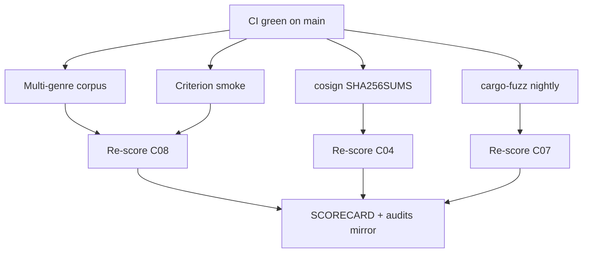

# MelosViz Work DAG

Atomic, FR-linked tasks agents can claim independently.

## Ready / in-flight (this wave)

| ID | Task | FR / pillar | Effort | Status |
|----|------|-------------|--------|--------|
| W-231 | Multi-genre synthetic golden corpus | C08 L71 | M | THIS PR |
| W-232 | cargo-fuzz targets + nightly CI | C07 L67 | M | THIS PR |
| W-238 | Cosign keyless sign-blob on SHA256SUMS | C04 L35 | M | THIS PR |
| W-239 | Criterion 1s smoke CI | C08 L72 | S | THIS PR |
| W-240 | .editorconfig + /debug/profile | C07 L63 / C05 L45 | S | THIS PR |
| W-241 | Re-score + SCORECARD | audit | S | THIS PR |

## Completed

| ID | Task | Status |
|----|------|--------|
| W-101…W-110 | Windows/OTLP/DX | #127 |
| W-201…W-217 | Eval + auto-update | #128 |
| W-204…W-222 | a11y/CodeQL/GHCR/deny | #129 |
| W-226…W-230 | Parity + Harbor + SHA256SUMS | #130 |
| W-233…W-237 | Screenshot baselines + supply-chain | #131 |

## Backlog (hard / org)

| ID | Task | Effort |
|----|------|--------|
| W-223 | Native mobile (iOS/Android) | L |
| W-224 | Apple notarization / Authenticode | L |
| W-225 | Offline air-gap install bundle | L |
| W-228 | Org signed-commit enforcement | org |

## Claim protocol

1. `claim W-2xx` on PR/issue.
2. Branch `feat/w2xx-<slug>`.
3. Reference FR ID in PR body.
