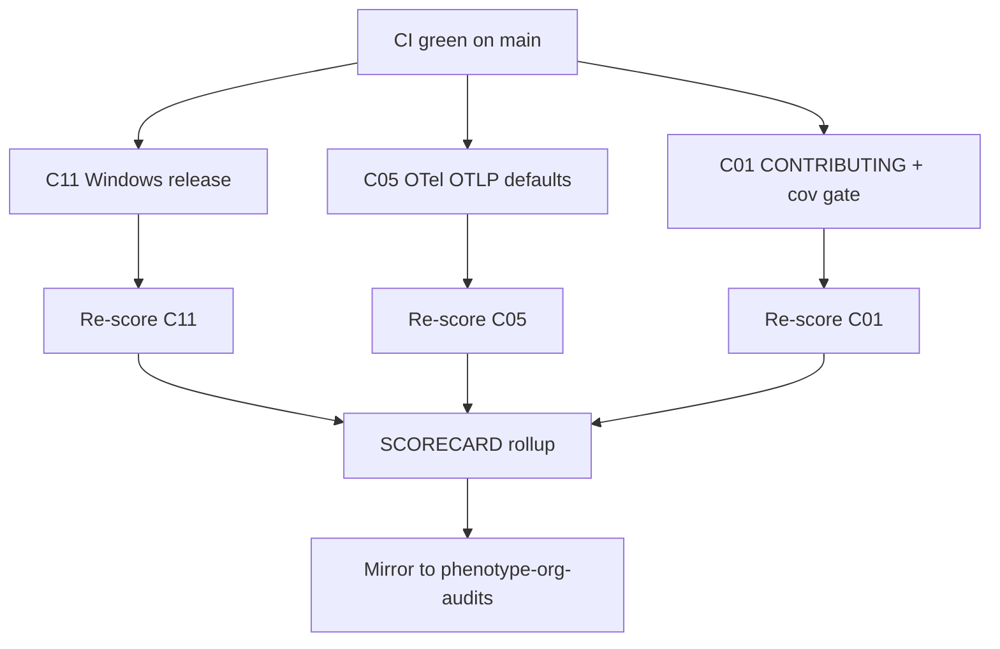

# MelosViz Work DAG

Atomic, FR-linked tasks agents can claim independently. Prefer one PR per
node unless a cluster is explicitly marked as a batch.

## Ready / in-flight (next wave)

| ID | Task | FR / pillar | Effort | Status |
|----|------|-------------|--------|--------|
| W-101 | Windows CLI zip in `release.yml` | C11 L108/L109 | M | THIS PR |
| W-102 | Windows Electrobun desktop job (best-effort) | C11 L108 | M | THIS PR |
| W-103 | OTLP exporter + traceparent propagation | C05 L42/L44 | M | THIS PR |
| W-104 | CONTRIBUTING.md + ARCHITECTURE.md | C01 L12/L13 | S | THIS PR |
| W-105 | Product THREAT_MODEL.md | C02 L20 | M | THIS PR |
| W-106 | FR catalog + this WORK_DAG | C03 L30.1/L30.2 | M | THIS PR |
| W-107 | Grafana dashboard JSON | C05 L47 | S | THIS PR |
| W-108 | `--cov-fail-under=85` in CI | C01 L11 / C08 L79 | S | THIS PR |
| W-109 | Weekly mutmut workflow | C07 L65 | S | THIS PR |
| W-110 | Re-score + SCORECARD ≥ mid-C | audit | S | THIS PR |

## Backlog (claim next)

| ID | Task | FR / pillar | Effort |
|----|------|-------------|--------|
| W-201 | Electrobun auto-update wiring | C11 L111 | M |
| W-202 | Harbor/portage eval adapter | C08 L76 | L |
| W-203 | Golden WAV corpus + parity harness | C08 L71/L75 | M |
| W-204 | axe/pa11y CI for web | C09 | M |
| W-205 | VISUAL_SPEC + screenshot goldens | C10 L107 | M |
| W-206 | Light theme tokens | C10 L104 | M |
| W-207 | CodeQL workflow in-repo | C04 L36 | M |
| W-208 | cargo-deny license lane | C06 L56 | M |
| W-209 | Frozen lock verify (`uv sync --frozen`) | C06 L58 | S |
| W-210 | SLO / error-budget doc | C02 L27 | M |

## Claim protocol

1. Comment on the PR or issue: `claim W-2xx`.
2. Branch: `feat/w2xx-<slug>`.
3. Reference the FR ID in the PR body.
4. Update this table Status column when merging.
