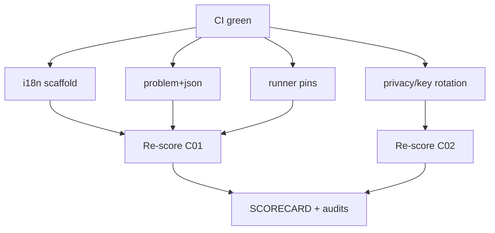

# MelosViz Work DAG

Atomic, FR-linked tasks agents can claim independently.

## Ready / in-flight (this wave)

| ID | Task | FR / pillar | Effort | Status |
|----|------|-------------|--------|--------|
| W-248 | i18n en/es catalogs + docs/I18N.md | C01 L16 | M | THIS PR |
| W-249 | problem+json bridge errors | C01 L14 | S | THIS PR |
| W-250 | ubuntu-22.04 runner pin consistency | C01 L10 | S | THIS PR |
| W-251 | PRIVACY + KEY_ROTATION + GOVERNANCE | C02 | M | THIS PR |
| W-252 | Type scale tokens + ErrorBoundary | C10 | S | THIS PR |
| W-253 | SDK stubs + CLAUDE.md + SIGNING.md | C00/C04 | S | THIS PR |
| W-254 | Re-score + SCORECARD | audit | S | THIS PR |

## Completed

| ID | Task | Status |
|----|------|--------|
| W-101…W-132 waves | prior closeouts | #127–#133 |

## Backlog (hard / org)

| ID | Task | Effort |
|----|------|--------|
| W-223 | Native mobile (iOS/Android) | L |
| W-224 | Apple notarization / Authenticode | L |
| W-228 | Org GPG/signed-commit branch protection | org |

## Claim protocol

1. `claim W-2xx` on PR/issue.
2. Branch `feat/w2xx-<slug>`.
3. Reference FR ID in PR body.
