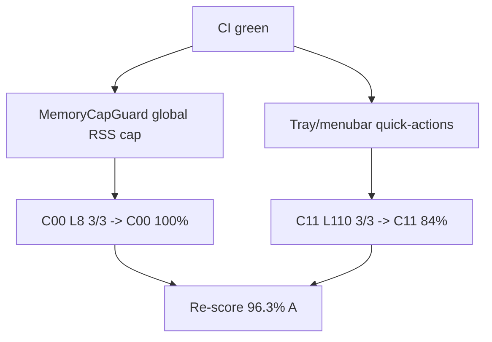

# MelosViz Work DAG

Atomic, FR-linked tasks agents can claim independently.

## Ready / in-flight (this wave)

| ID | Task | FR / pillar | Effort | Status |
|----|------|-------------|--------|--------|
| W-304 | Global memory-cap enforcement (`security.MemoryCapGuard`; soft 429 / hard 503 problem+json; audited; fails open) | C00 L8 · G-C00-04 · WBS-P4.7 | M | THIS PR |
| W-305 | Wire memory-cap check into `/analyze` `/build` `/render`; RSS/cap gauges on `/metrics` | C00 L8 · WBS-P4.7 | S | THIS PR |
| W-306 | Forward `HTTPException.headers` (e.g. `Retry-After`) through `http_exception_problem` | C00 L8 | S | THIS PR |
| W-307 | Electrobun tray/menubar quick-actions (Show/Open Bridge Health/Quit) | C11 L110 · G-C11-03 · WBS-P4.2 | M | THIS PR |
| W-308 | Re-score SCORECARD (p1k → 96.3% A) | audit | S | THIS PR |

## Completed

| ID | Task | Status |
|----|------|--------|
| W-301 | `@melosviz/ui` shared component package (`Button`/`EmptyState`/`Skeleton`) | #150 |
| W-302 | Wire `PlaylistPanel` + `Skeleton` re-export to `@melosviz/ui` (real consumer, not stub) | #150 |
| W-303 | Re-score SCORECARD (p1j → 95.8% A) | #150 |
| W-297 | R3F canvas fixture + CI pixelmatch golden | #149 |
| W-298 | C00 L6 continuous-profiler audit resync | #149 |
| W-299 | AGENT_QUICKSTART + C03 100% | #149 |
| W-300 | Re-score SCORECARD (p1i → 95.6% A) | #149 |
| W-294 | In-process continuous profiler (`MELOSVIZ_PROFILE=continuous`/`2`) | #148 |
| W-295 | Mitigate G-C07-01 (Linux desktop-e2e; GUI host-gated note) | #148 |
| W-296 | Re-score SCORECARD (p1h → 94.8% A) | #148 |
| W-291 | SceneView canvas SR (role=img + aria-live) | #147 |
| W-292 | Bridge RateLimiter/RenderQuota race stress | #147 |
| W-293 | Re-score SCORECARD (p1g → 94.5% A) | #147 |
| W-288 | Web playlist empty/zero state | #146 |
| W-289 | `@melosviz/bridge-client` SDK stub | #146 |
| W-290 | Re-score SCORECARD (p1f → 94.3% A) | #146 |
| W-284 | Desktop Bun inject traceparent | #144 |
| W-285 | SPA focus-trap / modal restore polish | #144 |
| W-286 | CLI + desktop i18n scaffold (en/es) | #144 |
| W-287 | Re-score SCORECARD (p1e → 94.1% A) | #144 |
| W-279 | Desktop/web STRIDE threat model | #141 |
| W-280 | Hypothesis RenderSpec property expansion | #141 |
| W-281 | `@melosviz/brand-tokens` package stub | #141 |
| W-282 | Windows release soft-fail narrow | #141 |
| W-283 | Re-score SCORECARD (p1d wave → 93.8% A) | #141 |
| W-275 | Hermetic CI smoke (fetch once + offline check) | #140 |
| W-272 | Feedback-loop timing budgets gate | #139 |
| W-273 | Shared brand token SoT (web/desktop) | #139 |
| W-274 | Re-score SCORECARD (p1b-sde-timing-tokens) | #139 |
| W-262 | Machine-trace gates (WBS/GAP/docs-trace CI) | #136 |
| W-263 | RenderQuota (CPU/concurrency caps) | #136 |
| W-264 | CircuitBreaker for bridge/render failures | #136 |
| W-265 | Audit JSONL retention prune | #136 |
| W-266 | Reserved-name / dep-confusion CI scanner | #136 |
| W-267 | OSSF TokenPermissions sweep | #136 |
| W-268 | Hermetics docs (LOCAL_RUN / CLAUDE / AIRGAP) | #136 |
| W-269 | fr-status.yaml + check_fr_status.py | #136 |
| W-270 | Re-score SCORECARD (p1-trace-c02-c06) | #136 |
| W-255 | OpenAPI export + drift CI | #135 |
| W-256 | Journey friction gate CI | #135 |
| W-257 | PARALLEL_AGENTS.md concurrency policy | #135 |
| W-258 | ThemeProvider + light theme | #135 |
| W-259 | Splash + desktop screenshot baseline | #135 |
| W-260 | Skeleton loading blocks | #135 |
| W-261 | Re-score + SCORECARD (openapi-theme-journeys) | #135 |
| W-101…W-254 | prior closeouts | #127–#134 |

## Backlog (hard / org)

| ID | Task | Effort |
|----|------|--------|
| W-223 | Native mobile (iOS/Android) | L |
| W-224 | Apple notarization / Authenticode | L |
| W-228 | Org GPG/signed-commit branch protection | org |

## Claim protocol

1. `claim W-2xx` on PR/issue.
2. Branch `feat/w2xx-<slug>`.
3. Reference FR ID in PR body.
