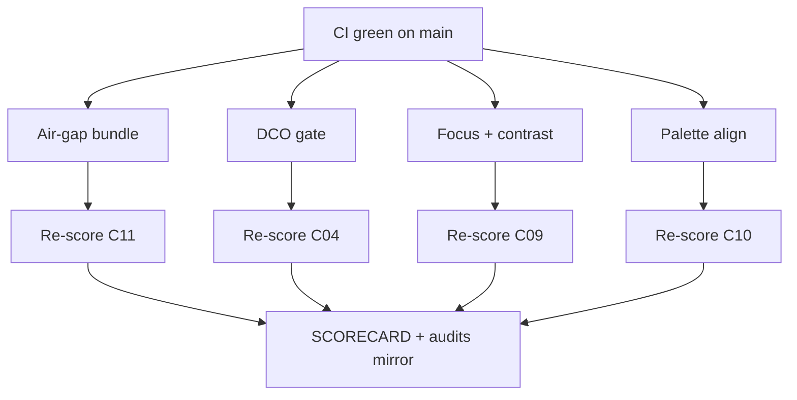

# MelosViz Work DAG

Atomic, FR-linked tasks agents can claim independently.

## Ready / in-flight (this wave)

| ID | Task | FR / pillar | Effort | Status |
|----|------|-------------|--------|--------|
| W-225 | Air-gap bundle script + AIRGAP.md | C11 L121 | M | THIS PR |
| W-242 | DISTRIBUTION_POLICY.md | C11 L122 | S | THIS PR |
| W-243 | DCO + dco.yml | C04 L34 | S | THIS PR |
| W-244 | Focus/contrast docs + desktop skip-link | C09 | M | THIS PR |
| W-245 | Web/desktop palette align #7c6af7 | C10 L105 | S | THIS PR |
| W-246 | rust-toolchain.toml | C03 L30.5 | S | THIS PR |
| W-247 | Re-score + SCORECARD | audit | S | THIS PR |

## Completed

| ID | Task | Status |
|----|------|--------|
| W-101…W-110 | Windows/OTLP/DX | #127 |
| W-201…W-217 | Eval + auto-update | #128 |
| W-204…W-222 | a11y/CodeQL/GHCR/deny | #129 |
| W-226…W-230 | Parity + Harbor + SHA256SUMS | #130 |
| W-233…W-237 | Screenshot baselines + supply-chain | #131 |
| W-231…W-241 | Corpus + cosign + cargo-fuzz | #132 |

## Backlog (hard / org)

| ID | Task | Effort |
|----|------|--------|
| W-223 | Native mobile (iOS/Android) | L |
| W-224 | Apple notarization / Authenticode | L |
| W-228 | Org GPG/signed-commit branch protection | org |

## Claim protocol

1. `claim W-2xx` on PR/issue.
2. Branch `feat/w2xx-<slug>`.
3. Reference FR ID in PR body.
