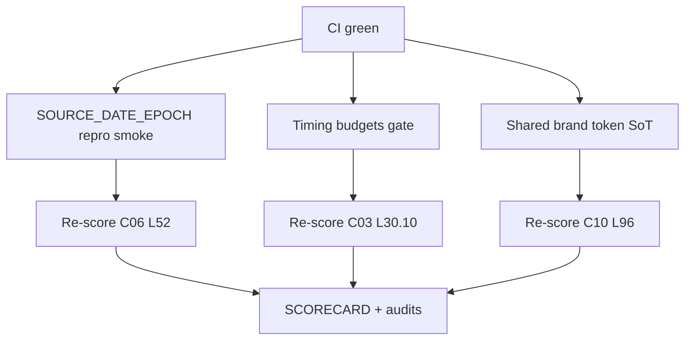

# MelosViz Work DAG

Atomic, FR-linked tasks agents can claim independently.

## Ready / in-flight (this wave)

| ID | Task | FR / pillar | Effort | Status |
|----|------|-------------|--------|--------|
| W-271 | SOURCE_DATE_EPOCH / bit-repro smoke (release + CI) | C06 L52 · WBS-P1.5 | M | THIS PR |
| W-272 | Feedback-loop timing budgets gate | C03 L30.10 · WBS-P1.11 | M | THIS PR |
| W-273 | Shared brand token SoT (web/desktop) | C10 L96 · WBS-P1.12 | M | THIS PR |
| W-274 | Re-score SCORECARD (p1b-sde-timing-tokens) | audit | S | THIS PR |

## Completed

| ID | Task | Status |
|----|------|--------|
| W-262 | Machine-trace gates (WBS/GAP/docs-trace CI) | #136 |
| W-263 | RenderQuota (CPU/concurrency caps) | #136 |
| W-264 | CircuitBreaker for bridge/render failures | #136 |
| W-265 | Audit JSONL retention prune | #136 |
| W-266 | Reserved-name / dep-confusion CI scanner | #136 |
| W-267 | OSSF TokenPermissions sweep | #136 |
| W-268 | Hermetics docs (LOCAL_RUN / CLAUDE / AIRGAP) | #136 |
| W-269 | fr-status.yaml + check_fr_status.py | #136 |
| W-270 | Re-score SCORECARD (p1-trace-c02-c06) | #136 |
| W-255 | OpenAPI export + drift CI | #135 |
| W-256 | Journey friction gate CI | #135 |
| W-257 | PARALLEL_AGENTS.md concurrency policy | #135 |
| W-258 | ThemeProvider + light theme | #135 |
| W-259 | Splash + desktop screenshot baseline | #135 |
| W-260 | Skeleton loading blocks | #135 |
| W-261 | Re-score + SCORECARD (openapi-theme-journeys) | #135 |
| W-101…W-254 | prior closeouts | #127–#134 |

## Backlog (hard / org)

| ID | Task | Effort |
|----|------|--------|
| W-223 | Native mobile (iOS/Android) | L |
| W-224 | Apple notarization / Authenticode | L |
| W-228 | Org GPG/signed-commit branch protection | org |

## Claim protocol

1. `claim W-2xx` on PR/issue.
2. Branch `feat/w2xx-<slug>`.
3. Reference FR ID in PR body.
