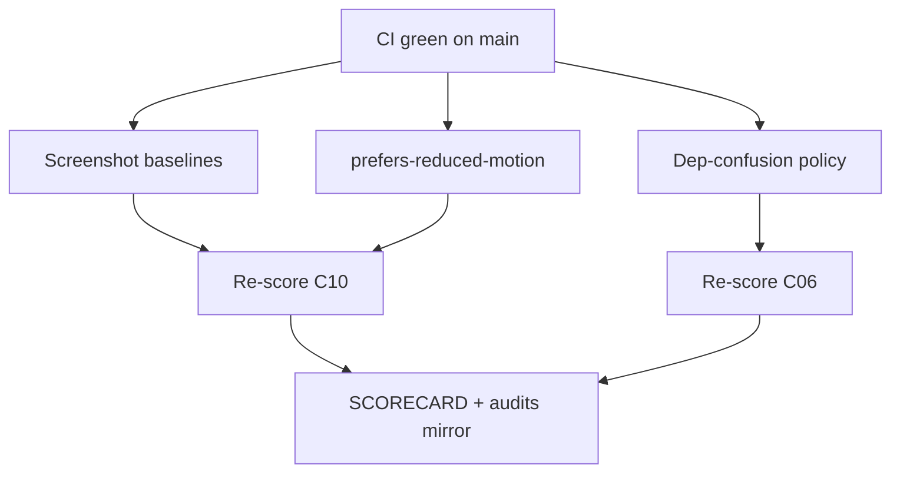

# MelosViz Work DAG

Atomic, FR-linked tasks agents can claim independently.

## Ready / in-flight (this wave)

| ID | Task | FR / pillar | Effort | Status |
|----|------|-------------|--------|--------|
| W-233 | Committed screenshot baseline + pixelmatch gate | C10 L107 | M | THIS PR |
| W-234 | prefers-reduced-motion (tokens + splash/loader/shell) | C10 L102 | S | THIS PR |
| W-235 | docs/visual IDENTITY + PROVENANCE | C10 L98/L106 | S | THIS PR |
| W-236 | Dependency-confusion policy doc | C06 L55 | S | THIS PR |
| W-237 | Re-score + SCORECARD | audit | S | THIS PR |

## Completed

| ID | Task | Status |
|----|------|--------|
| W-101…W-110 | Windows/OTLP/DX | #127 |
| W-201…W-217 | Eval + auto-update | #128 |
| W-204…W-222 | a11y/CodeQL/GHCR/deny | #129 |
| W-226…W-230 | Parity + Harbor + SHA256SUMS | #130 |

## Backlog (hard / org)

| ID | Task | Effort |
|----|------|--------|
| W-223 | Native mobile (iOS/Android) | L |
| W-224 | Apple notarization / Authenticode | L |
| W-225 | Offline air-gap install bundle | L |
| W-228 | Org signed-commit enforcement | org |
| W-231 | Real multi-genre golden corpus | M |
| W-232 | cargo-fuzz nightly CI | L |

## Claim protocol

1. `claim W-2xx` on PR/issue.
2. Branch `feat/w2xx-<slug>`.
3. Reference FR ID in PR body.
