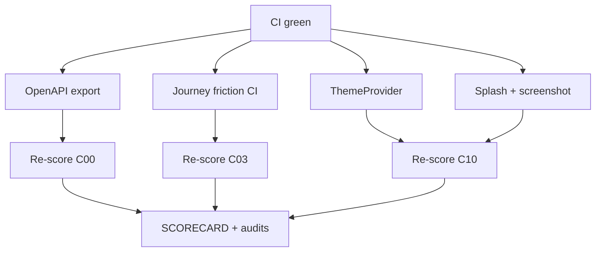

# MelosViz Work DAG

Atomic, FR-linked tasks agents can claim independently.

## Ready / in-flight (this wave)

| ID | Task | FR / pillar | Effort | Status |
|----|------|-------------|--------|--------|
| W-255 | OpenAPI export + drift CI | C00 L2 | M | THIS PR |
| W-256 | Journey friction gate CI | C03 L30.12 | M | THIS PR |
| W-257 | PARALLEL_AGENTS.md concurrency policy | C03 L30.9 | S | THIS PR |
| W-258 | ThemeProvider + light theme | C10 L104 | M | THIS PR |
| W-259 | Wire splash.html + desktop screenshot baseline | C10 L103/L107 | M | THIS PR |
| W-260 | Skeleton loading blocks | C10 L99 | S | THIS PR |
| W-261 | Re-score + SCORECARD | audit | S | THIS PR |

## Completed

| ID | Task | Status |
|----|------|--------|
| W-101…W-254 | prior closeouts | #127–#134 |

## Backlog (hard / org)

| ID | Task | Effort |
|----|------|--------|
| W-223 | Native mobile (iOS/Android) | L |
| W-224 | Apple notarization / Authenticode | L |
| W-228 | Org GPG/signed-commit branch protection | org |

## Claim protocol

1. `claim W-2xx` on PR/issue.
2. Branch `feat/w2xx-<slug>`.
3. Reference FR ID in PR body.
